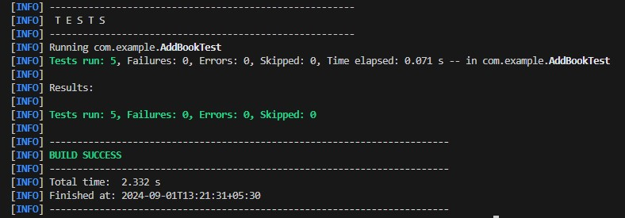
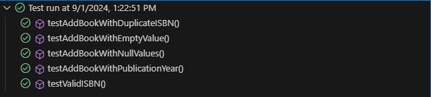
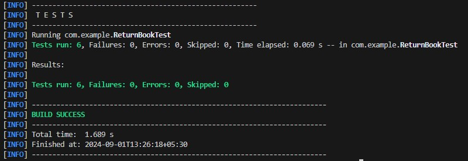
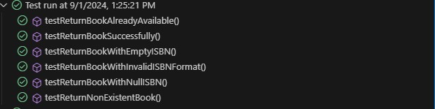
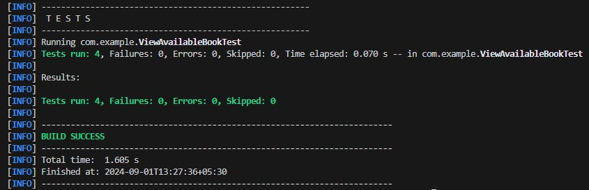
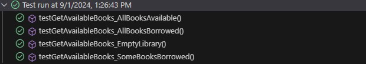
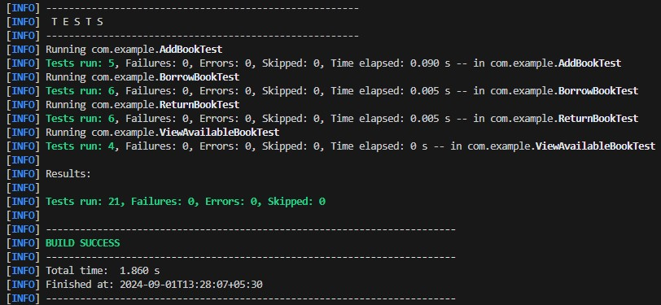

# Library Management System

## Test Report

---

### Add Book

**Description**: This section contains the results for testing the "Add Book" functionality. The test verifies that books are correctly added to the library's collection.

  

  

---

### Borrow Book

**Description**: This section includes results for the "Borrow Book" functionality, testing various scenarios of borrowing books.

  

  

---

### Return Book

**Description**: This section contains the test results for the "Return Book" functionality, verifying that books are correctly returned to the library.

  

  

---

### Available Book

**Description**: This section shows the results for testing the "View Available Books" functionality, ensuring that the library correctly displays books that are currently available.

  

  

---

### All Tests

**Description**: This section provides an overview of all test cases executed.

  

